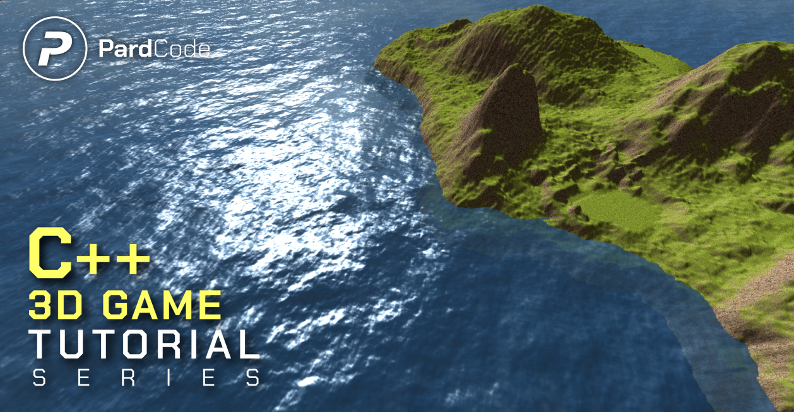

[]()
[](https://discord.gg/RymBzwKPyZ)
[](https://www.patreon.com/pardcode)
[](https://www.youtube.com/playlist?list=PLv8DnRaQOs5-ST_VDqgbbMRtzMtpK36Hy)
[](https://github.com/PardCode/CPP-3D-Game-Tutorial-Series/tags)

## C++ 3D Game Tutorial Series
`C++ 3D Game Tutorial Series` is a tutorial series designed to help developers of all levels—from novice to expert—take their first steps into game development from scratch using C++.
This series will teach you how to create a 3D game sample, 
starting with creating a window using the Win32 API and progressing to building a game engine that enables the development of a functional 3D game. 
Specifically, the series covers the development of:
* DX3D Game Engine (composed by the following sub-systems)
  * DirectX 11 3D Graphics Engine
  * Win32 Windowing System
  * Input System
  * Entity-Component System
* Game Sample

The aim of this series is to provide developers with the foundational knowledge needed to have full control over game development, 
starting from low-level systems (such as the Graphics Engine, Input Manager, Entity System etc.) 
all the way to high-level concepts (e.g. Entities).

This repository contains:
* The `master` branch, which contains the source code of the entire project developed in the tutorial series.
* The `DX3D` folder, which contains both the public API and the source code of the DX3D engine, that will be implemented and used to create the game sample.
* The `Game` folder, which contains the source code of the game sample itself.

It is possible to access the source code of each tutorial by checking the [`Tags`](https://github.com/PardCode/CPP-3D-Game-Tutorial-Series/tags) list.

Additionally, the repository includes branches such as `AssetsAndLibs`, which are related to the previous version of the C++ 3D Game Tutorial Series.

The license of this repository is available [here](#license).


## Quick Guide to build the 3D Game Sample

### Prerequisites:
* Visual Studio 2019 or later.
* Windows 10 or later.

Open `DirectXGame.sln` project, available under the project root folder.<br>
In Visual Studio, press the `Local Windows Debugger` button available in the toolbar.

## Public discussion forum
[The Discord Server](https://discord.gg/RymBzwKPyZ)  is the go-to place for news about the tutorial series, discussions on the latest developments, 
and any questions you may have about the `C++ 3D Game Tutorial Series`.

[](https://discord.gg/RymBzwKPyZ)

## Support
This project is offered under the free and permissive MIT license, but it requires financial support to continue its development.<br/> 
If the `C++ 3D Game Tutorial Series` has been helpful to you, consider supporting it through [`Patreon`](https://www.patreon.com/pardcode).<br/>  
Every contribution makes the difference, no matter the amount.<br/>
A big thank you to all the patrons who have supported me so far! <br/>
  
[](https://www.patreon.com/pardcode)  

## License

The license for this project is based on the modified MIT License.

This means you are free to use, modify, and distribute the code from this repository. However, there are two conditions you must follow:

* Include the license text in your product (e.g., in the "About" window of a GUI application or the "About/Credits" section of a 2D/3D video game).
* Include the license text in all source code files (copy and paste the license text at the top of each source code file you obtain from this repository, even if you have made partial modifications).

If you wish to modify and redistribute the source code files, you may optionally add your own copyright notice alongside the license text, as follows:

```
...
C++ 3D Game Tutorial Series (https://github.com/PardCode/CPP-3D-Game-Tutorial-Series)
<project name>, <website link or nothing>
  
Copyright (c) 2019-2025, PardCode
Copyright (c) <your years>, <your name>  
...
```

The license text is available in the [`LICENSE`](LICENSE) file.


