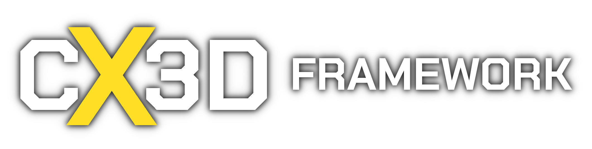
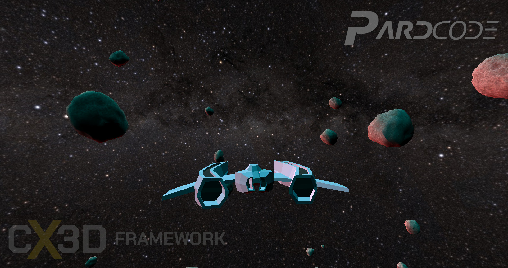

[]()
[]()
[]()
[](https://discord.gg/RymBzwKPyZ)
[](https://www.patreon.com/pardcode)
[](https://www.youtube.com/PardCode)


## An easy to use C++ 3D Game Framework

The `CX3D Framework` is an easy to use Game Framework for the development of 3D Games in C++.<br>
The framework is written in C++ 17 and it provides a set of features that allow the users to make games quickly at low-level.<br> 
At the same time, the users can improve `CX3D` by adding new functionalities or extending the existing ones.<br>
Games made upon this framework, and the framework itself, can be easily debugged and compiled in Release and/or Debug Mode.

The project aims to give the developers a complete and total control over the development of their games, starting from the internal `low-level` systems like Graphics Engine, Input Manager, Game System etc. arriving to the `high-level` classes (e.g. Entities).

This repository contains:
* Source Code of `CX3D Framework`,
* Source Code of a series of `Samples` that show how to use the framework (e.g. SpaceShooterGame).
* Documentation

The repository contains also branches like `AllTutorials` and `AssetsAndLibs`, related to the YouTube Tutorial Series called `C++ 3D Game Tutorial Series`:<br> 
These branches must be considered completely unrelated to the framework.<br>
`CX3D Framework` derives from the Tutorial Series above mentioned.<br> 

The license is available [here](#license).

## Features

`CX3D Framework` is currently composed by the following (yet incomplete) list of features:

**Game System**
* Entity System
  * Object-Oriented
  * Dynamic Creation and Release of custom Entities through templating features: `createEntity<MyEntity>()`
  * Event-based Logic support: `onCreate()`, `onUpdate(f32 deltaTime)`, ...
  * Default Entity classes available out-of-the-box: `LightEntity`,`MeshEntity`,`CameraEntity`,...

**Graphics Engine**
* Graphics APIs: `DirectX 11`
* Forward Rendering
* Phong-Based Lighting
* Static Meshes Support: `.obj` (all formats supported by `tinyobjloader`)
* Textures Support: `.jpg`,`.png`,`.bmp`,`.tga` etc. (all formats supported by `DirectXTex`) 
* Materials Support: `HLSL` Shading Language, Textures, Custom Data Passage

**Input Manager**
* Mouse Input Events Support
* Keyboard Input Events Support

**Windowing System**
* Native windowing and event support under Windows.

## Quick Guide to build CX3D Framework and Game Sample

### Prerequisites:
* Visual Studio 2019 or later.
* Windows 10 or later.

Open `SpaceShooterGame.sln` Project, available under the `Samples/SpaceShooterGame` folder.<br>
In Visual Studio, press the `Local Windows Debugger` button available in the main Toolbar.

## Public discussion forum
[The Discord Server](https://discord.gg/RymBzwKPyZ) is the place for project news, discussions of latest developments and any questions you have on how to use the `CX3D Framework` to develop your own 3D Games.


## Support
This project is available under a free and permissive license, but needs a financial support to sustain its development.<br/> 
If `CX3D Framework` is helpful to you, consider to support it through [`Patreon`](https://www.patreon.com/pardcode).<br/>  
Every single contribution makes the difference, regardless the amount.<br/>
Many thanks to all [**these people**](#supporters) who have supported me so far! <br/>
  
[](https://www.patreon.com/pardcode)  

### Supporters

Thank you so much for your huge support!

**Patreon Supporters (alphabetical order)**  

Adam L. - Ahmad A. - Alex G. - Andrey G. - Andrew C. - Andrew M. - Anotherbear Gamer - Asterot13 - Austin M.<br/>
Bastien R. - bdfy - Biuret - Carlo S. - Daniel W. - Dennis - Edward T.O. - Elite Salad - EthanEdits - GameEngineer - Guarded<br/>
hisuzuki - Howl C - Jack - James B. - James K. - JaviFML - Jesse M.C. - Jonas F. - Josh C. - Joshua v. - Katherine M. - Kim W.<br/>
kuronk cat - Lie - Mackay N. - Manuel H. - Mateusz P. - Matthew - Michael W. - Miles H. - Mohammed A. - Murdo M.<br/>
Nikhil R. - Neil W. - Oliver H. - Otturd - Patrick B. - Patrick L. - Peterson R. - RamblingBaba - Ridtichai B. - Rem saigao<br/>
REX Li - Robson - SleepingDog - Slotho - Snip - Squeegiefilms - Tatsuya - Tentacle Princess - The Spygineer<br/>
The Tutorial Chef - TheDevUK - Tim. A. - Tom L. - Valgard - Werner O. - WyattFlash<br/>

**All YouTube - Discord - GitHub - Twitter - Facebook followers and viewers**  

P.S.: If you are a Patron and you want to be added/removed to/from this list,
please send a message to PardCode through Patreon.


## License

The license of this project is based on the modified MIT-License.

That means you can do whatever you want with the code available in this repository. <br>
The only conditions to meet are:

- include the license text in your product (e.g. in the About Window of a GUI Application, About/Credits Section of a 2D/3D VideoGame)
- include the license text in all the source code files (copy-paste the license text to the top of all the source code files you get from this repository, even if you have partially modified them.)


If you want to modify and redistribute the source code files available in this repository, you can optionally add your own copyright notice together with the license text in this way:

```
...
CX3D Game Framework (https://github.com/PardCode/CX3D)
<project name>, <website link or nothing>
  
Copyright (c) 2019-2022, PardCode
Copyright (c) <your years>, <your name>  
...
```

The license text is available in the [`LICENSE`](LICENSE) file.


