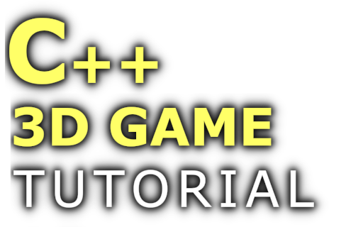

**C++ 3D Game Tutorial Series** is a
YouTube tutorial series, whose purpose is to help all those who want to take their first steps in
the game development from scratch.
In this series will be developed a 3D Game Demo, starting from the creation of a Window by using Win32 API ,
going through the making of a 3D Graphics Engine,
and all the necessary sub-systems in order to achieve a complete 3D Game,
like the Audio System, GUI System, Script System, Entity Component System, Input System and so on.
