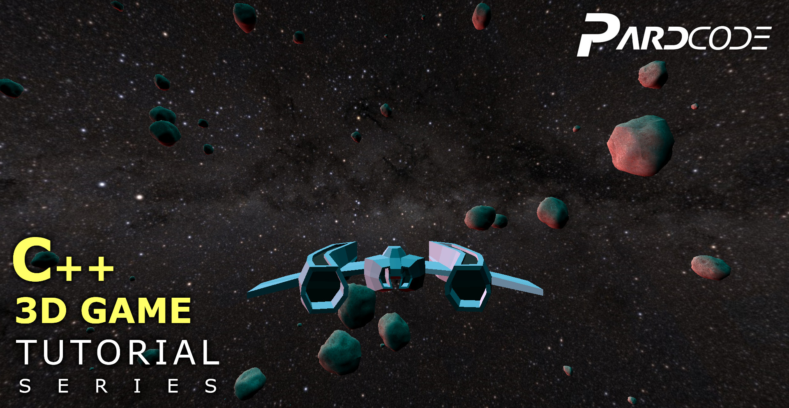
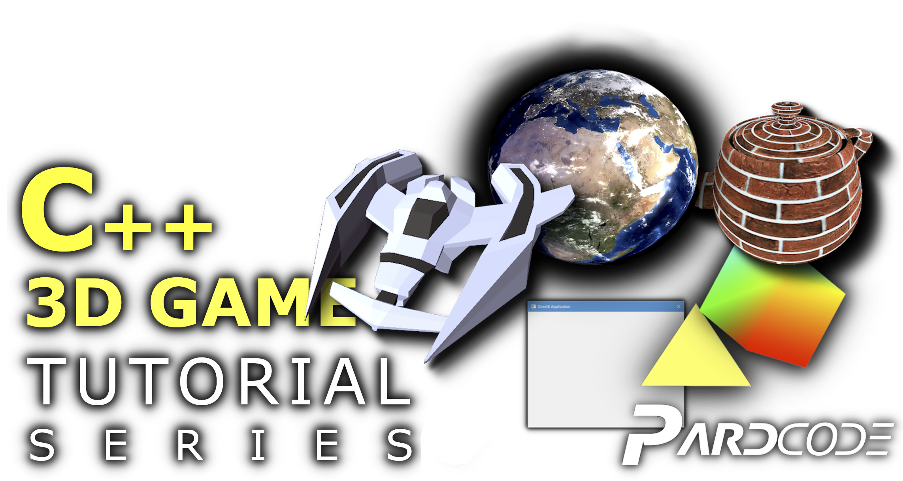

[]()
[](https://discord.gg/RymBzwKPyZ)
[](https://www.patreon.com/pardcode)
[](https://www.youtube.com/channel/UCs1ssVSR49YItKE7DZ3-Jcw)

[`C++ 3D Game Tutorial Series`](https://www.youtube.com/playlist?list=PLv8DnRaQOs5-ST_VDqgbbMRtzMtpK36Hy) is a YouTube Tutorial Series,</br>
whose purpose is to help all those who want to take their first steps in the game development from scratch.</br>
In this series you'll learn how to create a 3D Game Demo, starting from the creation of a Window by using Win32 API</br>
to the making of all the necessary sub-systems in order to achieve a 3D Game Demo, like</br>

- DirectX 3D Graphics Engine</br>
- Windowing System</br>
- Input System</br>
- Entity System</br>
- Forward Rendering</br>
- Phong-Based Lighting</br>

---

---


For any **questions**, **doubts** or **clarifications** about the `C++ 3D Game Tutorial Series`, you can join
the [discord server](https://discord.gg/RymBzwKPyZ), where you can meet other users or developers like you.<br/>
Before to ask any question, check the [FAQs](https://github.com/PardCode/CPP-3D-Game-Tutorial-Series/wiki/Frequently-Asked-Questions).
The answers you are searching for could be already there.<br/>
You can find the license [here](#license).

---

This project is available under a free and permissive license, but needs a financial support to sustain its development.<br/> 
The development includes both the making of video tutorials and the writing of the code.<br/> 
If this project is helpful to you, consider to support it through [`Patreon`](https://www.patreon.com/pardcode).<br/>  
Any single contribution would be greately appreciated, regardless the amount.<br/>
Many thanks to all [**these people**](#supporters) who have supported me so far! <br/>
  
[](https://www.patreon.com/pardcode)  


# Supporters

Thank you so much for your huge support!

**Patreon Supporters (alphabetical order)**  

Ahmad A. - Andrew C. - Andrew M. - Anotherbear Gamer - Asterot13 - Austin M. - Bastien R. - bdfy - Biuret<br/>
Carlo S. - Daniel W. - Edward T.O. - Elite Salad - hisuzuki - Howl C - James B. - Jesse M.C.<br/>
Joshua v. - Kim W. - kuronk cat - Lie - Manuel H. - Mateusz P. - Matthew - Miles H.<br/>
Mohammed A. - Murdo M. - Nikhil R. - Neil W. - Oliver H. - Patrick B. - Ridtichai B. - Rem saigao<br/>
REX Li - Robson - Snip - Squeegiefilms - The Spygineer - The Tutorial Chef - Valgard - Werner O. - WyattFlash<br/>

**All YouTube, Discord, GitHub, Twitter followers and viewers** 

P.S.: If you are a Patron and you want to be added or removed from this list,
please send a message to PardCode through Patreon.

# License

The license of this project is based on the modified MIT-License.

That means you can do whatever you want with the code available in this repository. 
The only conditions to meet are:

- include the license text in your product (e.g. in the About Window of a GUI program, or Credits Section of a 2D/3D Visual Game)
- include (or simply not delete) the license text in all the source code files you get from this repository (copy-paste the license text to the top of all the source code files you get from this repository, even if you have partially modified them. )


If you want to modify and redistribute the source code files available in this repository, you can optionally add your own copyright notice together with the license text in this way:

```
...
C++ 3D Game Tutorial Series (https://github.com/PardCode/CPP-3D-Game-Tutorial-Series)
<project name>, <website link or nothing>
  
Copyright (c) 2019-2021, PardCode
Copyright (c) <your years>, <your name>  
...
```

The license text is available in the [`LICENSE`](https://github.com/PardCode/CPP-3D-Game-Tutorial-Series/blob/AllTutorials/LICENSE) file.
